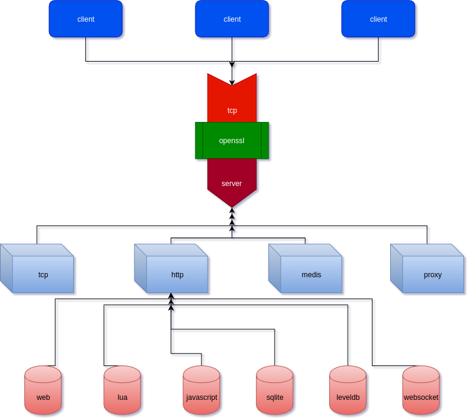

# mongols 简介

mongols不依赖于任何事件库，其并发性能却远远强于著名的libevent、libev和libuv。

mongols支持三种脚本语言lua,js和chai,你的品味决定你的选择。对mongols而言，它们是无差异的。

mongols提供一个python绑定：[pymongols](https://github.com/webcpp/pymongols)，它使得在python中也能轻松写出极快的web应用。

它提供的接口非常友好，使得任何试图基于tcp、resp或http协议开发高性能网络服务器的开发者都能够轻易地完成工作。

而且，它提供的所有服务器均能像nginx一样实现master-worker多进程模型：

！[multiprocessing anything](doc/image/multiprocess.png)

下载：[https://github.com/webcpp/mongols](https://github.com/webcpp/mongols)