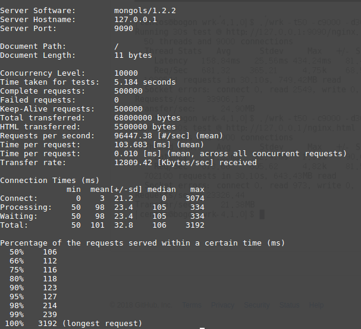
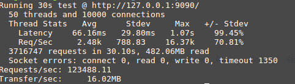
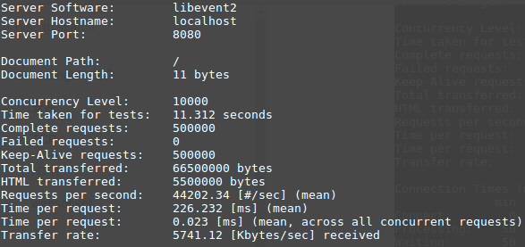

# http 服务器

http 服务器建构在tcp 服务器之上。内置完整的form处理，可以自动解析GET和POST表单，支持POST文件上传，并且支持会话管理和缓存机制。开发者完全可以将其视为完整的的支持http/1.1的应用服务器。

来看代码：

```cpp

#include <mongols/http_server.hpp>

int main(int, char**) {
    auto f = [](const mongols::request&) {
        return true;
    };
    auto g = [](const mongols::request& req, mongols::response & res) {
        res.content = std::move("hello,world");
        res.status = 200;
    };
    int port = 9090;
    const char* host = "127.0.0.1";
    mongols::http_server
    server(host, port, 5000, 8096, 0/*2*/);
    server.set_enable_session(false);
    server.set_enable_cache(false);
    server.run(f, g);
}

```

http服务器构造时可以通过第五个参数选择是否使用多线程机制，当其为大于0时，其值为工作线程数。

`run`方法需要两个函数参数，第一个可用来过滤客户端，第二个则用来生成响应。


http_server的并发性能非常好，远高于常见的基于libevent、libev或者libuv的其他http服务器:





比如我用libevent2写个最基本的http服务器作为对比，代码如下：

```cpp

#include <cstring>
#include <event2/buffer.h>
#include <event2/event.h>
#include <event2/http.h>
#include <iostream>
#include <signal.h>

static struct event_config* server_config = 0;
static struct event_base* server_event = 0;
static struct evhttp* server = 0;
static const char* host = "127.0.0.1";
static int port = 8080;
static inline void signal_normal_cb(int sig);
static inline void generic_request_handler(struct evhttp_request* req, void* arg);

int main(int, char**)
{
    server_config = event_config_new();
    event_config_set_flag(server_config, EVENT_BASE_FLAG_NOLOCK);
    event_config_set_flag(server_config, EVENT_BASE_FLAG_EPOLL_USE_CHANGELIST);

    server_event = event_base_new_with_config(server_config);
    server = evhttp_new(server_event);

    evhttp_bind_socket(server, host, port);
    evhttp_set_gencb(server, generic_request_handler, NULL);
    evhttp_set_default_content_type(server, "text/plain;charset=UTF-8");
    evhttp_set_timeout(server, 60);

    signal(SIGHUP, signal_normal_cb);
    signal(SIGTERM, signal_normal_cb);
    signal(SIGINT, signal_normal_cb);
    signal(SIGQUIT, signal_normal_cb);

    event_base_dispatch(server_event);
    evhttp_free(server);
    event_base_free(server_event);
    event_config_free(server_config);

    return 0;
}

static inline void signal_normal_cb(int sig)
{
    struct timeval delay = { 1, 0 };
    switch (sig) {
    case SIGTERM:
    case SIGHUP:
    case SIGQUIT:
    case SIGINT:
        if (server_event && !event_base_loopexit(server_event, &delay)) {
        }
        break;
    }
}
static inline void generic_request_handler(struct evhttp_request* ev_req, void* arg)
{
    struct evbuffer* ev_res = evhttp_request_get_output_buffer(ev_req);
    struct evkeyvalq *ev_output_headers = evhttp_request_get_output_headers(ev_req),
                     *ev_input_headers = evhttp_request_get_input_headers(ev_req);
    const struct evhttp_uri* ev_uri = evhttp_request_get_evhttp_uri(ev_req);

    evhttp_add_header(ev_output_headers, "Server", "libevent2");
    evbuffer_add(ev_res, "hello,world", 11);
    evhttp_send_reply(ev_req, 200, "OK", ev_res);
}


```
用ab或者wrk压测该http服务器，如图:



不仅比mongols慢得多，而且内存消耗几乎十倍于mongols。

## 使用路由机制

http_server可以像一些web开发框架一样，通过添加路由映射来支持业务逻辑：

```cpp

    server.add_route({"GET"}, "^/get/([a-zA-Z]+)/?$"
    , [](const mongols::request& req, mongols::response& res, const std::vector<std::string>& param) {
        res.content = req.method + "<br/>" + param[1];
        res.status = 200;
    });

    server.add_route({"POST"}, "^/post/([0-9]+)/?$"
    , [](const mongols::request& req, mongols::response& res, const std::vector<std::string>& param) {
        res.content = req.method + "<br/>" + param[1];
        res.status = 200;
    });
    server.run_with_route(f)

```
`add_route`方法第一个参数是业务支持的`method`列表，第二个参数是`uri`需匹配的正则模式，第三个参数则是业务逻辑`handler`。业务`handler`的第三个参数是通过google RE2库进行计算获得的匹配正则模式的`group`。通过这种方式，http_server看起来像个灵活的框架。

`run_with_route`的参数是`f`用了过滤客户端，与`run`方法的第一个参数具有相同的含义。

## 关于文件上传支持

强烈建议采用mongols包含的[websocket](websocket.html)服务器进行部署。原因有二：其一、效率更高，其二、授权可能冲突。http服务器内嵌的文件上传支持库MPFDParser已经被原作者删除，不复存在，其原授权为GPLv3和LGPL，且其代码已经被我修正，与mongols的MPLv2授权可能发生冲突。后续版本的http服务器可能不再包含支持文件上传的代码。
