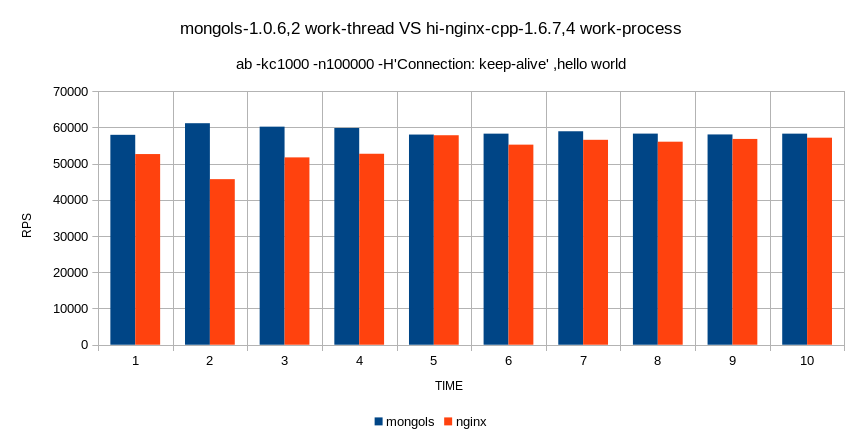
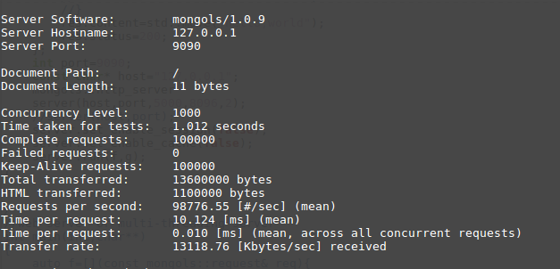

# http 服务器

http 服务器建构在tcp 服务器之上。内置完整的form处理，可以自动解析GET和POST表单，支持POST文件上传，并且支持会话管理和缓存机制。开发者完全可以将其视为完整的的支持http/1.1的应用服务器。

来看代码：

```cpp
#include <mongols/http_server.hpp>

int main(int,char**)
{
	auto f=[](const mongols::request&){
		    return true;
	};
	auto g=[](const mongols::request& req,mongols::response& res){
		    res.content=std::move("hello,world");
		    res.status=200;
	};
	int port=9090;
	const char* host="127.0.0.1";
	mongols::http_server 
	server(host,port,5000,8096,2);
	//server(host,port,5000,8096,0);
	server.set_enable_session(false);
	server.set_enable_cache(false);
	server.run(f,g);
}

```

http服务器构造时可以通过第五个参数选择是否使用多线程机制，当其为大于0时，其值为工作线程数。

`run`方法需要两个函数参数，第一个可用来过滤客户端，第二个则用来生成响应。


http_server的并发性能非常好，远高于常见的基于libevent、libev或者libuv的其他http服务器。请参考[压力测试](https://www.cnblogs.com/hi-nginx/p/9527696.html)和下图：



再看http_server在ubuntu 16.04上的一般表现:


