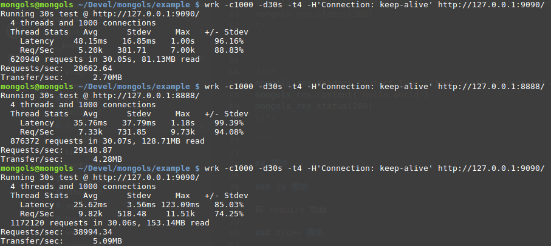

# js 服务器

这是为了方便使用javascript进行web开发准备的。

它与nodejs的不同在于它使用duktape引擎。虽然该引擎的执行效率比不上v8引擎，但是它是轻量级的，效率虽不够好，但也不太差。其执行效率方面的劣势可通过多进程化服务器、开启lru缓存等多种途径来弥补。压测显示，多进程化后，其并发性能高于nodejs。




上图是一个简单的hello,world测试，node在8888端口,js_server在9090端口。第一次压测js_server为单进程，第三次压测时采用多进程化js_server。

特别需要说明的是，在测试比较中发现，nodejs(v11)完成上述测试通常需要很多的内存消耗——50MB-120MB,与并发数量正相关。而js_server的内存消耗近通常不会超过1.8MB，与并发数量没什么关系。

来看例子：

```cpp

#include <mongols/js_server.hpp>

int main(int, char**) {
    int port = 9090;
    const char* host = "127.0.0.1";
    mongols::js_server
    server(host, port, 5000, 8096, 0/*2*/);
    server.set_root_path("html/js");
    server.set_enable_bootstrap(true);
    server.run("html/js/package", "html/js/package");
}


```

`run`方法的第一个参数表示js模块的搜索路径，第二个参数则表示c/c++模块的搜索路径。

以下是单一入口文件:

```js
//index.js

/*
var foo = require('foo')
mongols_res.header('Content-Type','text/plain;charset=UTF-8')
mongols_res.content(foo.hello())
mongols_res.status(200)
*/

/*
var math = require('math/math')
var v=math.minus(1,3)/math.add(100,3)
mongols_res.header('Content-Type','text/plain;charset=UTF-8')
mongols_res.content(v.toString())
mongols_res.status(200)
*/


/*
var loaded = mongols_module.require('adder/libadder.so','adder')
mongols_res.header('Content-Type','text/plain;charset=UTF-8')
mongols_res.content(loaded?adder(1,2).toString():'failed load c module.')
mongols_res.status(200)
*/

/*
var loaded = mongols_module.require('concat/libconcat.so','concat')
mongols_res.header('Content-Type','text/plain;charset=UTF-8')
mongols_res.content(loaded?concat('Hello,','world'):'failed load c module.')
mongols_res.status(200)
*/


///*
mongols_res.header('Content-Type','text/plain;charset=UTF-8')
mongols_res.content('hello,world')
mongols_res.status(200)
//*/

```

## 模块

### js 模块

用`require`加载

### c/c++ 模块

用`mongols_module.require`加载

写动态库终究麻烦，js_server支持直接注册c/c++函数和类到服务器：

```c++

class person : public mongols::js_object {
public:

    person() : mongols::js_object(), name("Tom"), age(0) {
    }
    virtual~person() = default;

    person* set_name(const std::string& name) {
        this->name = name;
        return this;
    }

    person* set_age(unsigned int age) {
        this->age = age;
        return this;
    }

    const std::string& get_name() {
        return this->name;
    }

    unsigned int get_age() {
        return this->age;
    }
private:
    std::string name;
    unsigned int age;
};

class studest : public person {
public:

    studest() : person() {
    }
    virtual~studest() = default;

    double get_score() {
        return this->score;
    }

    studest* set_score(double score) {
        this->score = score;
        return this;
    }
private:
    double score;
};

// some code


server.register_class_constructor<person>("person");
server.register_class_method(&person::set_age, "set_age");
server.register_class_method(&person::get_age, "get_age");
server.register_class_method(&person::set_name, "set_name");
server.register_class_method(&person::get_name, "get_name");

server.register_class_constructor<studest>("studest");
server.register_class_method(&studest::get_score, "get_score");
server.register_class_method(&studest::set_score, "set_score");
server.set_base_class<mongols::js_object, person>();
server.set_base_class<person, studest>();

server.register_function(&mongols::md5, "md5");
server.register_function(&mongols::sha1, "sha1");


```

```javascript

var handlebars = require('handlebars')
var s=new studest()
s.set_name("Jerry").set_age(14).set_score(74.6)
var text='hello,world'
var tpl=handlebars.compile('name: {{name}}\nage: {{age}}\nscore: {{score}}\ntext:{{text}}\ntext_md5: {{md5}}\ntext_sha1: {{sha1}}')
var content=tpl({name:s.get_name(),age:s.get_age(),score:s.get_score(),text:text,md5:md5(text),sha1:sha1(text)})
mongols_module.free(s)
mongols_res.header('Content-Type','text/plain;charset=UTF-8')
mongols_res.content(content)
mongols_res.status(200)

```

就这一点而言，js_server与lua_server是基本一致的。不过，lua的执行效率远高于duktape——如果不开启lru缓存。

特别注意:

- 所有需要注册的c++类必须继承`mongols::js_object`类且不允许多重继承。
- 所有注册的c++类，用`new`创建、使用完毕后，一定要使用`mongols_module.free`方法进行垃圾回收，因为duktape不管理c++类实例生命期。


## API

### mongols_req
- uri
- method
- client
- param
- user_agent
- has_header
- get_header
- has_form
- get_form
- has_session
- get_session
- has_cookie
- get_cookie
- has_cache
- get_cache
### mongols_res
- status
- content
- header
- session
- cache

### 其他

`mongols_module`对象实例下有个`read`方法，完整可读取文件。