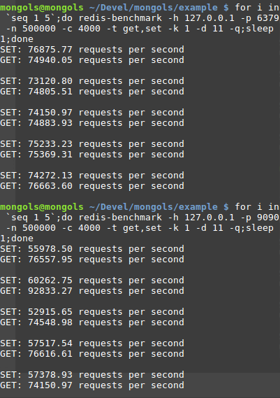

# medis 服务器


medis_server 是一个使用RESP协议进行交互的混合型NOSQL服务器。

它像redis一样，提供多种复杂数据结构——字符串、哈希、列表、集合、队列和堆栈——但是它提供两种保存选择:内存或者硬盘(通过leveldb)。如果这些数据结构还不能满足需要，它还提供sqlite，用户可以自由通过SQL定义数据结构。

medis_server 内嵌lua(5.3)脚本引擎，对于某些需要在服务器端完成的计算，应该是有所帮助的。

所有这些功能，都能通过RESP协议进行访问。也就是说，可以用redis-cli实现与medis_server的交互。

来看例子：

```cpp
#include <mongols/medis_server.hpp>

int main(int, char**) {
    int port = 9090;
    const char* host = "127.0.0.1";
    mongols::medis_server
    server(host, port, 5000, 8096, 0/*2*/);
    server.set_lua_package_path("html/lua/package/?.lua;","html/lua/package/?.so;");
    server.run("html/leveldb", "html/sqlite/test.db");
}

```

# 压力测试



上图分别对get和set命令进行测试。上:redis，下:medis。提示：medis是硬盘读写，而redis是内存读写。


# 提示

- 高热数据应该保存放在内存，低热数据应该保存在硬盘，中热数据按读多还是写多相机选择内存或硬盘。

- 对于非字符串的高级数据结构，首选在内存。

- 特殊情况下，可以用[messagepack](https://msgpack.org/)将高级数据结构转换为字符串类型进行存储。

- 保存在内存中的数据按LRU算法更新。

- 服务器退出时，只有内存数据会消失。

# 命令列表

所有命令均为大写，前缀为`_`下划线的表示保存在内存中。所有保存在内存中的数据均可以通过`_FLUSHALL`命令全部清除。

所有内存命令支持过期时间机制，默认过期时间为300秒。

## 常规

- ECHO value

- PING [value]

- FLUSHALL or _FLUSHALL


## 字符串

- SET key value or _SET key value

- GET key or _GET key

- DEL key or _DEL key

- EXISTS key or _EXISTS key

- MSET key value [key value ...] or _MSET key value [key value ...]

- MGET key [key ...] or _MGET key [key ...]

- GETSET key value or _GETSET key value

- STRLEN key or _STRLEN key

- APPEND key value or _APPEND key value

- INCR key or _INCR key

- INCRBY key increment or _INCRBY key increment

- DECR key or _DECR key

- DECRBY key decrement or _DECRBY key decrement

- SETRANGE key start value or _SETRANGE key start value

- GETRANGE key start count or _GETRANGE key start count

- _EXPIRE key seconds

- _TTL key

## 哈希

- HSET key field value or _HSET key field value

- HGET key field or _HGET key field

- HDEL key field [field ...] or _HDEL key field [field ...]

- HEXISTS key field or _HEXISTS key field

- _HERASE key

- HLEN key or _HLEN key

- HGETALL key or _HGETALL key

- HMSET key field value [field value ...] or _HMSET key field value [field value ...]

- HMGET key field [field ...] or _HMGET key field [field ...]

- _HEXPIRE key seconds

- _HTTL key

## 列表

- LFRONT key or _LFRONT key

- LBACK key or _LBACK key

- LPUSH_FRONT key [value ...]  or _LPUSH_FRONT key [value ...] 

- LPUSH_BACK key [value ...]  or _LPUSH_BACK key [value ...] 

- LPOP_FRONT key  or _LPOP_FRONT key 

- LPOP_BACK key   or _LPOP_BACK key

- LLEN key or _LLEN key 

- LRANGE key start count or _LRANGE key start count

- _LEXISTS key value 

- _LERASE key

- _LEXPIRE key seconds

- _LTTL key

## 集合(有序)

- SADD SADD key member [member ...] or _SADD key member [member ...]

- SDEL key member [member ...] or _SDEL key member [member ...]

- SMEMBERS key or _SMEMBERS key

- SEXISTS key or _SEXISTS key

- SLEN key or _SLEN key

- SDIFF key1 key2 or _SDIFF key1 key2

- SINTER key1 key2 or _SINTER key1 key2

- SUNION key1 key2 or _SUNION key1 key2

- SSYDIFF key1 key2 or _SSYDIFF key1 key2

- _SERASE key

- _SEXPIRE key seconds

- _STTL key


## 队列

-  _QPUSH key member [member ...]

-  _QPOP key

-  _QEMPTY key

-  _QFRONT key

-  _QBACK key

-  _QERASE key

-  _QLEN key

-  _QEXPIRE key seconds

-  _QTTL key


## 堆栈

- _ZPUSH key member [member ...]

- _ZPOP key

- _ZTOP key

- _ZEMPTY key

- _ZERASE key

- _ZLEN key

- _ZEXPIRE key seconds

- _ZTTL key

## SQLite

- SQLCMD statement

    `SQLCMD 'update a set name="test" where id=4 or id=5'`

- SQLBINDCMD statement

    `SQLBINDCMD "INSERT INTO A(ID,NAME)VALUES(:ID,:NAME);" ":ID" 4 ":NAME" "CPP"`

- SQLTRANSACTION statement

    `SQLTRANSACTION 'INSERT INTO A(ID,NAME)VALUES(14,"14");UPDATE A SET NAME="TEST" WHERE ID=14;'`

- SQLQUERY statement

    `SQLQUERY 'SELECT * FROM A ORDER BY ID desc limit 3'`


## lua 脚本引擎
该引擎为lua5.3，内置一个名为`medis`的表变量,它包含一个`CMD`函数，它可以调用所有上述操作方法。
如果调用以下两个命令时，包含额外参数，那么可以通过`medis`表中`ARGS`表域访问到它们。它们的值从第三个值开始计算。

如果需要返回值，可使用`medis`表变量中的`RESULT`变量，该变量可返回布尔值、整数、字符串和无嵌套的表。

为了方便，我还在lua引擎中嵌入了一个可用于正则计算的表：`mongols_regex`，内含三个函数:

- full_match
- partial_match
- match

以及一个用于md5和sha1计算的表:`mongols_hash`，内含两个函数:
- md5
- sha1

使用方法可参考:[regex.lua](https://github.com/webcpp/mongols/blob/master/example/html/lua/regex.lua)

把一组相关计算放在lua脚本中，并在服务器端运行它，可以省去网络交互的麻烦。当然，也会消耗一些服务器时间。所以，该引擎主要针对轻量级计算。

- LUACONTENT statement [arg ...]

	`LUACONTENT "local JSON = require('JSON') local t =JSON:encode({a=medis.ARGS[4],b=2,{c=4}}) medis.CMD('SET',medis.ARGS[3],t)" lua 100`

- LUASCRIPT path [arg ...]

	`LUASCRIPT 'html/lua/medis.lua' lua Tom`

```lua

local echo=require('echo')
medis.CMD('SET',medis.ARGS[3],echo.concat('hello,',medis.ARGS[4]))
medis.RESULT={a='hello',b='world',1,3.5,'test'}

```
