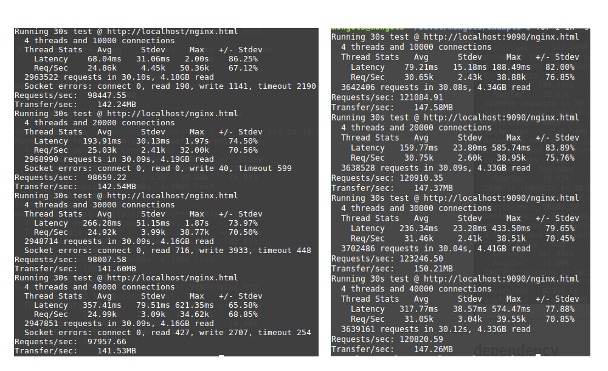

# 多进程化

mongols提供的所有服务器设施既可以多线程化也可以多进程化。

并且支持在多进程化的同时多线程化。

来看代码：

```cpp

#include <unistd.h>
#include <sys/wait.h>
#include <sys/signal.h>
#include <sys/prctl.h>
#include <mongols/util.hpp>
#include <mongols/web_server.hpp>

#include <iostream>
#include <algorithm>

int main(int, char**) {
    //    daemon(1, 0);
    auto f = [](const mongols::request & req) {
        if (req.method == "GET" && req.uri.find("..") == std::string::npos) {
            return true;
        }
        return false;
    };
    int port = 9090;
    const char* host = "127.0.0.1";
    mongols::web_server
    server(host, port, 5000, 512000, 0/*2*/);
    server.set_root_path("html");
    server.set_mime_type_file("html/mime.conf");
    server.set_list_directory(true);
    server.set_enable_mmap(true);

    std::function<void(pthread_mutex_t*, size_t*) > ff = [&](pthread_mutex_t* mtx, size_t * data) {
        prctl(PR_SET_NAME, "mongols: worker");
        server.run(f);
    };

    std::function<bool(int) > g = [&](int status) {
        std::cout << strsignal(WTERMSIG(status)) << std::endl;
        return false;
    };

    mongols::multi_process main_precess;
    main_precess.run(ff, g);


}

```

多进程化最合适的场景是web_server，可以显著提升性能：




以上测试使用4个工作进程，对比于使用同样数目工作进程的nginx，更胜一筹。如果你有兴趣用更大压力测试，你会发现，比如我用wrk测试，20000并发以上，随着并发数的增加nginx的弱势会越来越明显。实际上，在同等使用单进程的情况下，mongols也比nginx更快更稳定！

## 子进程重启

如需子进程重启，可向管理进程发送SIGHUP信号。当然，如果子进程非正常终止，例如被killed，子进程会自动重启。

## 注意

虽然mongols所包含的所有server均可以如上例所示进行多进程化从而提升性能，但是因为其中的一些server内部包含了leveldb或sqlite组件，而这两种组件只支持多线程化，并不支持多进程化，所有在对这些server进行多进程化时，`ff`函数应该包含一些配置数据库的代码，使得不同工作进程绑定不同的数据库。具体实现可参考`example`。

这一点非常重要。

不过话说回来，mongols提供的服务器在单进程情况下，性能已经非常优越了。在多数情况下，无需做多进程化即可满足——还能避免无谓的复杂代码。

## 多进程化其他网络库

mongols配备的多进程化工具是通用的，可用于其他网络库的多进程化。这里给出一个libevent的例子，其实只需在[](https://mongols.hi-nginx.com/doc/http.html)中的libevent例子里稍微添加几行代码：

```cpp

#include <cstring>
#include <event2/buffer.h>
#include <event2/event.h>
#include <event2/http.h>
#include <iostream>
#include <mongols/util.hpp>
#include <signal.h>

static struct event_config* server_config = 0;
static struct event_base* server_event = 0;
static struct evhttp* server = 0;
static const char* host = "127.0.0.1";
static int port = 8080;
static inline void signal_normal_cb(int sig);
static inline void generic_request_handler(struct evhttp_request* req, void* arg);

int main(int, char**)
{
    server_config = event_config_new();
    event_config_set_flag(server_config, EVENT_BASE_FLAG_NOLOCK);
    event_config_set_flag(server_config, EVENT_BASE_FLAG_EPOLL_USE_CHANGELIST);

    server_event = event_base_new_with_config(server_config);
    server = evhttp_new(server_event);

    evhttp_bind_socket(server, host, port);

    evhttp_set_gencb(server, generic_request_handler, NULL);
    evhttp_set_default_content_type(server, "text/plain;charset=UTF-8");
    evhttp_set_timeout(server, 60);

    std::function<void(pthread_mutex_t*, size_t*)> ff = [&](pthread_mutex_t* mtx, size_t* data) {
        signal(SIGHUP, signal_normal_cb);
        signal(SIGTERM, signal_normal_cb);
        signal(SIGINT, signal_normal_cb);
        signal(SIGQUIT, signal_normal_cb);

        event_base_dispatch(server_event);
        evhttp_free(server);
        event_base_free(server_event);
        event_config_free(server_config);
    };

    std::function<bool(int)> g = [&](int status) {
        return false;
    };

    mongols::multi_process main_process;
    main_process.run(ff, g);

    return 0;
}

static inline void signal_normal_cb(int sig)
{
    struct timeval delay = { 1, 0 };
    switch (sig) {
    case SIGTERM:
    case SIGHUP:
    case SIGQUIT:
    case SIGINT:
        if (server_event && !event_base_loopexit(server_event, &delay)) {
        }
        break;
    }
}
static inline void generic_request_handler(struct evhttp_request* ev_req, void* arg)
{
    struct evbuffer* ev_res = evhttp_request_get_output_buffer(ev_req);
    struct evkeyvalq *ev_output_headers = evhttp_request_get_output_headers(ev_req),
                     *ev_input_headers = evhttp_request_get_input_headers(ev_req);
    const struct evhttp_uri* ev_uri = evhttp_request_get_evhttp_uri(ev_req);

    evhttp_add_header(ev_output_headers, "Server", "libevent2");
    evbuffer_add(ev_res, "hello,world", 11);
    evhttp_send_reply(ev_req, 200, "OK", ev_res);
}


```

该例子像mongols一样，也支持子进程重启！

多进程化的libevent例子自然会有更好的性能表现。但是，libevent在单进程下的性能极限只有这么多——所以即使已经多进程化，该例子的吞吐率还是没有赶上单进程的mongols的http_server例子，实际上还差不少呢！