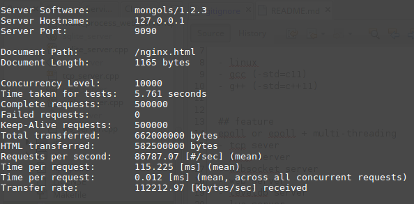
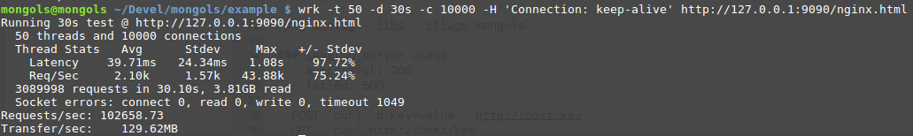
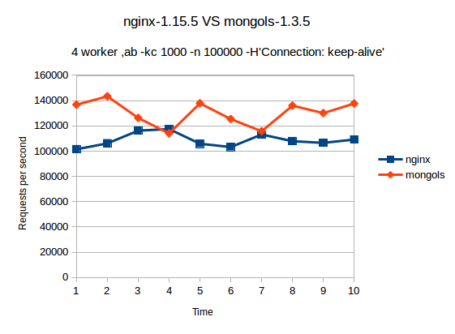

# 多进程化

mongols提供的所有服务器设施既可以多线程化也可以多进程化。

并且支持在多进程化的同时多线程化。

来看代码：

```cpp

#include <unistd.h>
#include <sys/wait.h>
#include <sys/signal.h>
#include <sys/prctl.h>
#include <mongols/util.hpp>
#include <mongols/web_server.hpp>

#include <iostream>
#include <algorithm>

int main(int, char**) {
    //    daemon(1, 0);
    auto f = [](const mongols::request & req) {
        if (req.method == "GET" && req.uri.find("..") == std::string::npos) {
            return true;
        }
        return false;
    };
    int port = 9090;
    const char* host = "127.0.0.1";
    mongols::web_server
    server(host, port, 5000, 512000, 0/*2*/);
    server.set_root_path("html");
    server.set_mime_type_file("html/mime.conf");
    server.set_list_directory(true);
    server.set_enable_mmap(true);

    std::function<void(pthread_mutex_t*, size_t*) > ff = [&](pthread_mutex_t* mtx, size_t * data) {
        prctl(PR_SET_NAME, "mongols: worker");
        server.run(f);
    };

    std::function<bool(int) > g = [&](int status) {
        std::cout << strsignal(WTERMSIG(status)) << std::endl;
        return false;
    };

    mongols::multi_process main_precess;
    main_precess.run(ff, g);


}

```

多进程化最合适的场景是web_server，可以显著提升性能：








以上测试使用4个工作进程，对比于使用同样数目工作进程的nginx，更胜一筹。如果你有兴趣用更大压力测试，你会发现，比如我用wrk测试，20000并发以上，随着并发数的增加nginx的弱势会越来越明显。实际上，在同等使用单进程的情况下，mongols也比nginx更快更稳定！

## 注意

虽然mongols所包含的所有server均可以如上例所示进行多进程化从而提升性能，但是因为其中的一些server内部包含了leveldb或sqlite组件，而这两种组件只支持多线程化，并不支持多进程化，所有在对这些server进行多进程化时，`ff`函数应该包含一些配置数据库的代码，使得不同工作进程绑定不同的数据库。具体实现可参考`example`。

这一点非常重要。

不过话说回来，mongols提供的服务器在单进程情况下，性能已经非常优越了。在多数情况下，无需做多进程化即可满足——还能避免无谓的复杂代码。