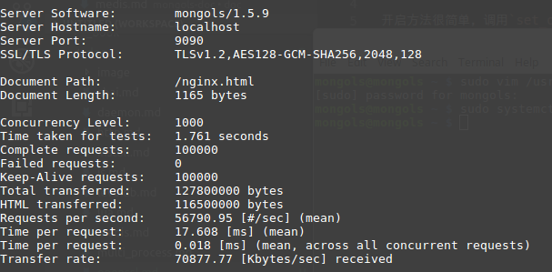
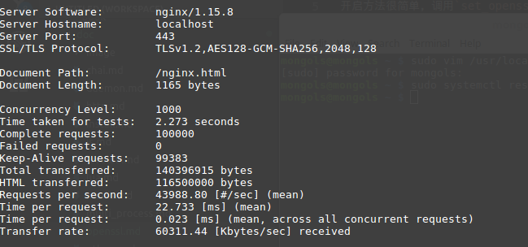

# openssl 支持

mongols所包含的所有服务器设施均支持openssl化。也就是说，开发者可以为（tcp|http|resp）协议“一键”开启openssl支持。

开启方法很简单，调用`set_openssl`方法即可。该方法第一个参数为crt文件，第二个参数是key文件。第三个参数选择openssl协议版本(默认tlsv1.2),第四个参数是ciphers(默认AES128-GCM-SHA256),第五个参数是flags(默认SSL_OP_NO_COMPRESSION)。通常只需设置前两个参数即可。

## 压测比较

一句话，工作进程相同的情况下，比NGINX更快、更稳定：

