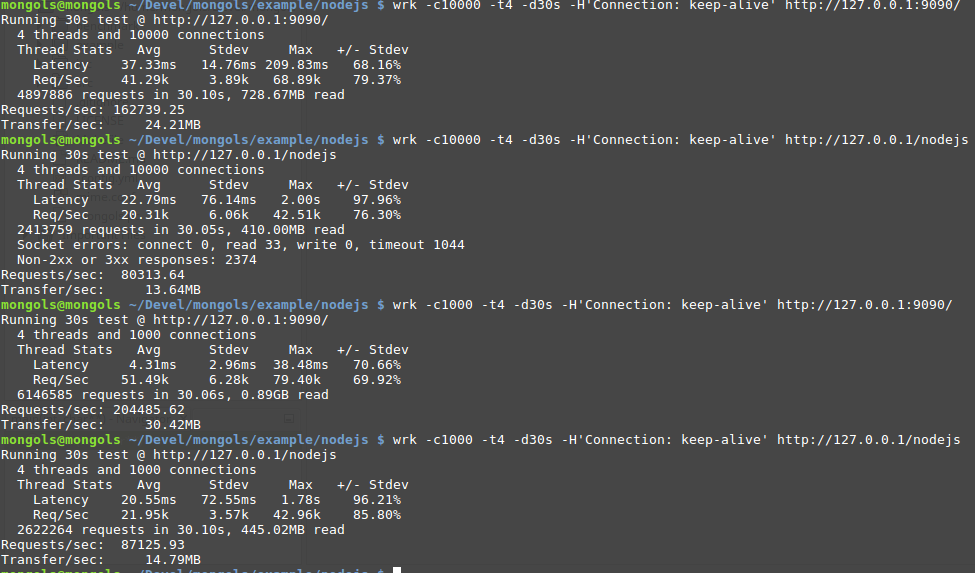

# 代理服务器

tcp_proxy_server 主要是为需要反向代理和负载均衡的场景准备的。

它既能做tcp代理，也能作http代理。内置负载均衡算法为轮询法。


## HTTP反向代理

来看一个http反向代理的例子：


```cpp

#include <unistd.h>
#include <sys/wait.h>
#include <sys/signal.h>
#include <sys/prctl.h>

#include <mongols/util.hpp>
#include <mongols/tcp_proxy_server.hpp>

#include <cstring>
#include <iostream>
#include <functional>

int main(int, char**) {
    //    daemon(1, 0);
    auto f = [](const mongols::tcp_server::client_t & client) {
        return true;
    };

    auto h = [&](const mongols::request & req) {
        return true;
    };

    int port = 9090;
    const char* host = "127.0.0.1";

    mongols::tcp_proxy_server server(host, port, 5000, 8192, 0/*2*/);


    server.set_enable_http_lru_cache(true);
    server.set_http_lru_cache_expires(1);
    server.set_default_http_content();

    //see example/nodejs
    server.set_backend_server(host, 8888);
    server.set_backend_server(host, 8889);
    if (!server.set_openssl("openssl/localhost.crt", "openssl/localhost.key")) {
        return -1;
    }

    //    server.run(f,h);


    std::function<void(pthread_mutex_t*, size_t*) > ff = [&](pthread_mutex_t* mtx, size_t * data) {
        server.run(f, h);
    };

    std::function<bool(int) > g = [&](int status) {
        std::cout << strsignal(WTERMSIG(status)) << std::endl;
        return false;
    };

    mongols::multi_process main_process;
    main_process.run(ff, g);
}


```

上例以多进程方式运行一个http反向代理服务器，服务器本身监听9090端口，代理两个后端服务器，后端服务器端口分别是8888和8889。

两个后端服务器都是输出helloworld的nodejs程序，代码很简单：

```javascript

var http = require('http');
var port = 8888;//8889

http.createServer(function (request, response) {
    response.writeHead(200, {'Content-Type': 'text/plain'});
    response.end('Hello World\n');
}).listen(port);

console.log('Server running at http://127.0.0.1:'+port+'/');

```

同样的后端，同样多的工作进程，如果比较于nginx的proxy_pass方案，无论是否开启缓存，mongols的并发性能都要强于nginx：




实际上，从 web server 到 reverse proxy，对比于mongols，nginx其实是一款很慢的服务器软件。

## 缓存加速

仅对http代理有效。

tcp_proxy_server通过lru算法+过期时间的策略实现加速。因为缓存在内存中，非常快。只有当请求方法、URI和参数都相同的请求，才会对应到同一个缓存内容。

## 安全防护

tcp_proxy_server可配置连接级的安全防护，通过`run`方法的参数。该参数是一个需要返回布尔值的functional,返回false则意味着直接关闭连接。

该functional以类`client_t`为参数。开发者可从该参数获取连接的系统唯一标识符`sid`，连接建立时间`t`，该连接已经发送数据的次数`count`，该连接的ip，以及服务器保持在线的连接总数`u_size`。有了这些量，开发者很轻易即可写出负责安全防护的functional,比如上例中的`f`可重写如下:

```cpp

    auto f = [](const mongols::tcp_server::client_t & client) {
        if(client.ip=="x.x.x.x"){
            return false;
        }
        if(client.u_size>100000){
            return false;
        }
        if(client.count/difftime(time(0),client.t)>50){
            return false;
        }
        return true;
    };

```
现在，`f`表示：如果服务器总连接数超过100000，或者单个连接发送数据的频率超过每秒50次，或者当前连接ip为`x.x.x.x`，就关闭当前连接。

如果开启http代理模式，还可以配置请求过滤的functional。例如上例中的`h`，可根据HTTP请求头信息实现自定义过滤。


关闭连接时，对tcp代理返回`close`字符串，对http代理返回403错误。开发者可通过`set_default_content`方法设置默认返回值。

## TCP 反向代理

例子:

```
#include <unistd.h>
#include <sys/wait.h>
#include <sys/signal.h>
#include <sys/prctl.h>

#include <mongols/util.hpp>
#include <mongols/tcp_proxy_server.hpp>

#include <cstring>
#include <iostream>
#include <functional>

int main(int, char**) {
    //    daemon(1, 0);
    auto f = [](const mongols::tcp_server::client_t & client) {
        return true;
    };

    int port = 9090;
    const char* host = "127.0.0.1";

    mongols::tcp_proxy_server server(host, port, 5000, 8192, 0/*2*/);

    server.set_enable_tcp_send_to_other(true);
    //see example/nodejs
    server.set_backend_server(host, 8886);
    server.set_backend_server(host, 8887);
    if (!server.set_openssl("openssl/localhost.crt", "openssl/localhost.key")) {
        return -1;
    }

    server.run(f);

}


```

`set_enable_tcp_send_to_other`决定消息是否转发其他在线客户端。