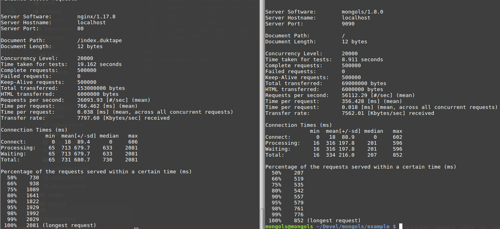

# qjs 服务器

mongols-1.7.1以后版本不再支持以duktape引擎实现的javascript服务器。

但是，自mongols-1.8.0开始，新增一个基于quickjs引擎的新的javascript服务器。性能较之以前，有较大提升。

来看例子：
```cpp
#include <mongols/qjs_server.hpp>
#include <mongols/util.hpp>

int main(int, char**)
{
    int port = 9090;
    const char* host = "127.0.0.1";
    mongols::qjs_server
        server(host, port, 5000, 8192, 0 /*2*/);
    server.set_root_path("html/qjs");
    server.set_enable_bootstrap(true);
    server.set_enable_lru_cache(false);
    server.set_lru_cache_expires(1);
    //    if (!server.set_openssl("openssl/localhost.crt", "openssl/localhost.key")) {
    //        return -1;
    //    }

    // server.set_shutdown([&]() {
    //     std::cout << "process " << getpid() << " exit.\n";
    // });
    // server.run();

    std::function<void(pthread_mutex_t*, size_t*)> ff = [&](pthread_mutex_t* mtx, size_t* data) {
        server.set_shutdown([&]() {
            std::cout << "process " << getpid() << " exit.\n";
        });
        server.run();
    };

    std::function<bool(int)> g = [&](int status) {
        return false;
    };

    mongols::multi_process main_process;
    main_process.run(ff, g);
}
```

```js
import * as std from "std";
import * as os from "os";
import * as bjson from "bjson";
import * as mongols from "mongols";

mongols.status(200);
mongols.header('Content-Type', 'text/plain');
mongols.content("hello,world\n");

```

简单的`hello,world`测试如下：


## 优化

qjs_server通过两个静态变量调整服务器工作状态。
### `qjs_server::memory_limit`
默认值是1GB。它负责配置quickjs运行时能够使用的最大内存量。因为每一工作进程配有一个运行时，所以配置此值时需要考虑机器的硬件约束。通常默认值即可。
### `qjs_server::ctx_called_limit`
默认值是10240。它负责配置每一quickjs运行时上下文被使用的次数。值过小会导致效率下降，值过大则可能导致内存使用上升。通常默认值即可。配置时，需与`qjs_server::memory_limit`协调。
### 开启lru缓存机制
调用`set_enable_lru_cache`方法，参数为`true`即可。此法甚妙。1秒的过期时间，即可令服务器功力大增。如下图：


## api

### request
- uri
- method
- client
- param
- user_agent
- has_header
- get_header
- has_form
- get_form
- has_session
- get_session
- has_cookie
- get_cookie
- has_cache
- get_cache
### response
- status
- content
- header
- session
- cache

## 比较

quickjs引擎是一个新的javascript引擎。它具备很多优点和新特性。其综合性能不及V8。此点自然会在一定程度上拖累qjs_server。

不过，qjs_server仍可优于nodejs——即使是号称最快nodejs框架fastify，也只能甘拜下风。


比较于hi-nginx-duktape，qjs_server亦可占上风：


hi-nginx-duktape配置如下：
```nginx
    location ~ \.duktape$ {
	hi_need_cache off;
	hi_need_cookies off;
	hi_need_session off;
        rewrite ^/(.*)\.duktape$ /$1 break;
        hi_duktape_script duktape/index.js;
    }

```

```javascript
 hi_res.header('Content-Type','text/plain;charset=UTF-8')
 hi_res.content('hello,world\n')
 hi_res.status(200)

```