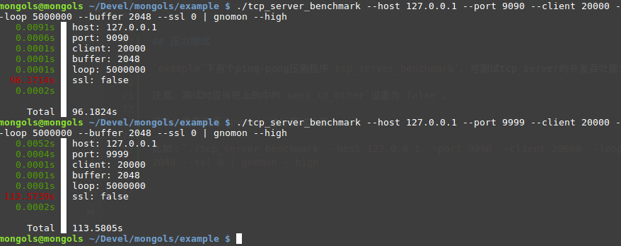

# tcp 服务器

tcp 服务器由两个类组成，一个是tcp_server,另一个是它的子类tcp_threading_server。


先看代码：

```cpp

#include <mongols/tcp_server.hpp>
#include <mongols/tcp_threading_server.hpp>

int main(int,char**)
{
	auto f=[](const std::pair<char*,size_t>& input
					 , bool & keepalive
                     , bool& send_to_other
                     , mongols::tcp_server::client_t& client
                    , mongols::tcp_server::filter_handler_function& send_to_other_filter){
					keepalive= KEEPALIVE_CONNECTION;
					send_to_other=true;
					return std::string(input.first,input.second);
				};
	int port=9090;
	const char* host="127.0.0.1";
	
	mongols::tcp_server
    //mongols::tcp_threading_server
	server(host,port);
	
	server.run(f);

}

```


`run`方法需要一个handler函数，可以是lambda。这个函数给予开发者任意处置客户端及其输入和输出的自由。通过这个函数，开发者几乎可以完全控制服务器的每一次I/O。tcp 服务器是所有其他服务器的核心。


## 安全

### 黑名单机制
该机制无需手写ip黑名单，而是根据以下三个静态变量配置自动发现、更新恶意ip并及时拒绝它们:

- tcp_server::backlist_size，黑名单最大长度，默认1024
- tcp_server::max_connection_limit，单个ip每秒能够发送连接请求的最大数量，默认30
- tcp_server::backlist_timeout，被拒绝ip被认为存在恶意行为的过期时间，默认86400秒,即整整一天

该机制默认并未开启。如果需要，只需通过方法`set_enable_blacklist`设置`true`即可。

### 发送频率限制机制
该机制限制通过配置以下静态变量识别恶意行为：

- tcp_server::max_send_limit，每秒最大消息发送次数，默认5


该机制默认并未开启。如果需要，只需通过方法`set_enable_security_check`设置`true`即可。

### 长连接过期机制
该机制通过配置静态变量`tcp_server::max_connection_keepalive`，限制长连接过期时间，默认60秒。

### 白名单机制
该机制提供两种配置IP地址白名单的方法：（1）通过`set_whitelist`方法和`del_whitelist`方法，（2）通过`set_whitelist_file`方法。推荐使用后者：新建一个专属目录比如`etc`，在里面新建一个纯文本文件例如`etc/whitelist.txt`；然后逐行写下合法IP地址的正则表达式(`#`号开头的行表示注释。服务器按先后顺序测试正则表达式，排序越靠前，优先级越高。)；最后把该文件地址传递给`set_whitelist_file`方法。当`etc/whitelist.txt`文件被修改时，服务器会自动升级内存中的白名单，无需重启服务器。

当然，使用第一种方法控制白名单也是可行的。

注意：白名单机制一旦通过`set_enable_whitelist`方法被启用（默认不启用），服务器将拒绝任何由不在白名单中的IP地址发起的连接请求。所以，请谨慎配置白名单。


## 压力测试

`example`下有个ping-pong压测程序`tcp_server_benchmark`，可测试tcp_server的并发吞吐能力。

注意，测试时应当把上例中的`send_to_other`设置为`false`，并且最大buffer值不应超过tcp_server的配置值，在上例中，是默认值8192——如果需要测试更大的buffer,则需加大tcp_server的buffer。

另外，推荐使用`gnomon`进行测试计量。

比如：`./tcp_server_benchmark --host 127.0.0.1 --port 9090 --client 20000 --loop 5000000 --buffer 2048 --ssl 0 | gnomon --high`

下图是与`muduo`的`pingpong_server`的压测比较图，mongols(单线程)在9090端口，muduo(4线程)在9999端口：



从耗时数值来看，mongols的优势并不明显。但是若结合CPU消耗和内存占用来看，则mongols的优势非常明显：

- CPU消耗: mongols < 28% , muduo > 54%
- 内存占用: mongols < 5MB, muduo > 60MB


