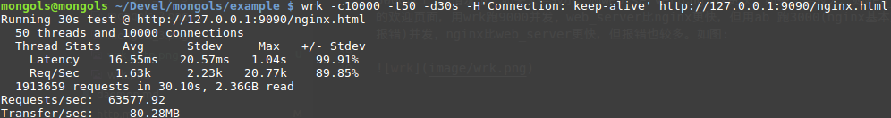
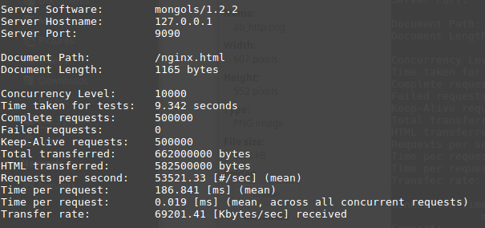
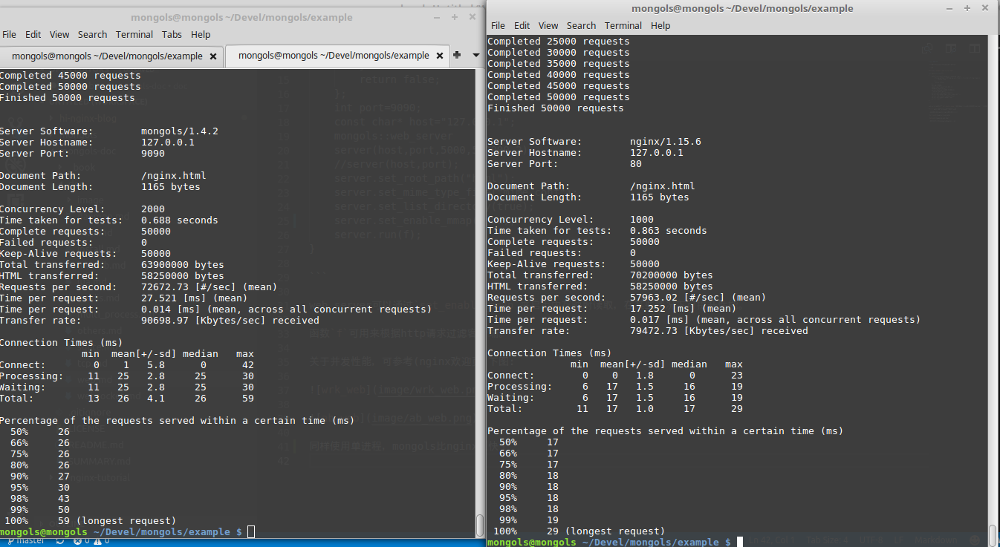

# web 服务器

这个服务器专门处理静态文件。来看代码:

```cpp

#include <mongols/web_server.hpp>

int main(int,char**)
{
	auto f=[](const mongols::request& req){
		if(req.method=="GET"&&req.uri.find("..")==std::string::npos){
			return true;
		}
		return false;
	};
	int port=9090;
	const char* host="127.0.0.1";
	mongols::web_server 
	server(host,port,5000,512000,2);
	//server(host,port);
	server.set_root_path("html");
	server.set_mime_type_file("mime.conf");
	server.set_list_directory(true);
	server.set_enable_mmap(true);
	server.run(f);
}

```

web_server可以通过`set_enable_mmap`来启用内存映射读取，在某些情况下可提升性能。

函数`f`可用来根据http请求过滤客户端。

关于并发性能，可参考(nginx欢迎页)下图：





mongols比nginx(1 worker)更快——mongols并发2000也比nginx并发1000更快！

